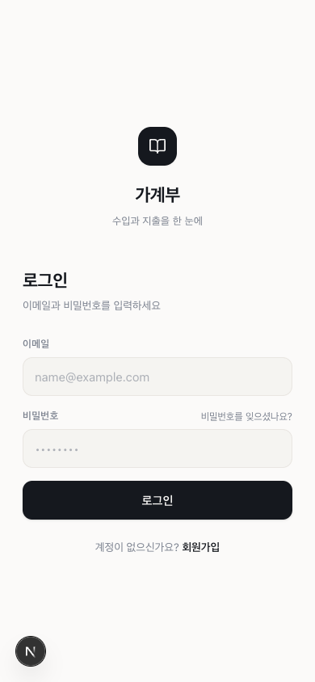
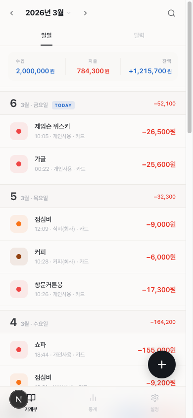
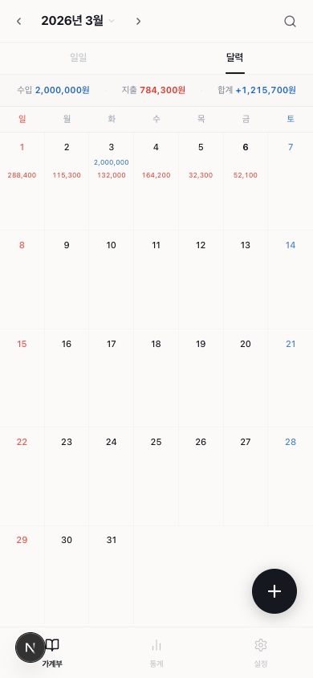
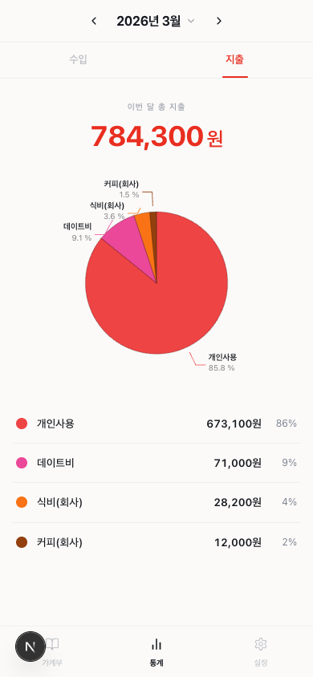
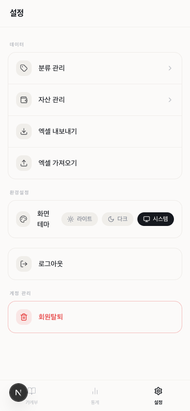
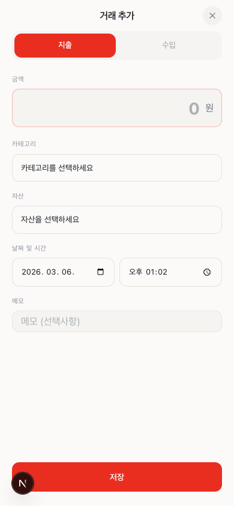

<div align="center">

# MoneyLog

**수입과 지출을 한 눈에 — 나만을 위한 스마트 가계부**


</div>

---

## 프로젝트 소개

MoneyLog는 **Next.js 15 App Router + Supabase** 기반으로 제작한 개인 가계부 웹 앱입니다.

모바일 퍼스트 디자인으로 스마트폰에서도 네이티브 앱처럼 편리하게 사용할 수 있으며, PWA를 통해 홈 화면에 추가하면 앱처럼 실행됩니다. 거래 기록부터 통계 시각화, 고급 검색·필터, 엑셀 내보내기·가져오기까지 일상적인 가계 관리에 필요한 모든 기능을 담았습니다.

---

## 화면 미리보기

| 로그인 | 일별 가계부 | 달력 뷰 |
|:---:|:---:|:---:|
|  |  |  |

| 통계 | 설정 | 거래 추가 |
|:---:|:---:|:---:|
|  |  |  |

---

## 주요 기능

### 가계부 기록
- **일별 뷰** — 날짜별 거래 목록과 수입/지출/잔액 합계를 한눈에 확인
- **달력 뷰** — 월간 달력에서 날짜별 금액 요약 조회, 날짜 클릭으로 상세 뷰 이동
- **거래 CRUD** — 수입/지출 등록·수정·삭제. 카테고리, 자산, 날짜·시간, 메모 지원
- **메모 자동완성** — 과거 메모 기반 입력 추천으로 반복 입력 최소화

### 검색 & 필터
- **키워드 검색** — 메모 기준 전체 기간 검색 (디바운스 300ms 자동 실행)
- **멀티 필터** — 기간 / 자산 / 카테고리 / 금액 범위를 조합해 정밀 조회
- **검색 결과 요약** — 필터 결과의 수입·지출 합계 즉시 표시

### 통계 & 분석
- **도넛 차트** — 월별 수입·지출을 카테고리별 비율로 시각화
- **카테고리 상세** — 카테고리 클릭 시 8개월 트렌드 라인 차트 + 거래 목록 조회
- **월 선택 피커** — 연·월 단위로 원하는 기간 통계 탐색

### 데이터 관리
- **카테고리 관리** — 커스텀 카테고리 생성·수정·삭제, 색상 팔레트, 드래그 앤 드롭 순서 변경
- **자산 관리** — 카드·현금·계좌 등 자산 등록·수정·삭제
- **엑셀 내보내기** — 거래 내역을 `.xlsx` 파일로 즉시 다운로드
- **엑셀 가져오기** — 엑셀 파일에서 거래 내역 일괄 임포트

### UX & 접근성
- **다크 모드** — 라이트/다크/시스템 설정 연동 테마 전환
- **PWA** — 홈 화면 추가 후 앱처럼 실행, 서비스 워커 기반 오프라인 캐싱
- **뒤로가기 지원** — History API로 오버레이/상세 화면에서 네이티브 뒤로가기 동작
- **모바일 최적화** — safe-area-inset 대응, Vaul Drawer, 터치 최적화 UI

---

## 기술 스택

### Frontend

| 분류 | 기술 |
|---|---|
| 프레임워크 | Next.js 15 (App Router, Server Actions) |
| 언어 | TypeScript 5 |
| 스타일 | Tailwind CSS 3 |
| UI 컴포넌트 | shadcn/ui + Radix UI |
| 드로어 | Vaul (모바일 친화적 Bottom Sheet) |
| 차트 | Recharts (Donut, Line Chart) |
| 폼 | React Hook Form + Zod v4 |
| 드래그 정렬 | dnd-kit |
| 날짜 | date-fns |

### Backend / Infra

| 분류 | 기술 |
|---|---|
| 인증 | Supabase Auth (쿠키 기반 세션, `getClaims()`) |
| 데이터베이스 | Supabase PostgreSQL (RLS 적용) |
| 파일 처리 | xlsx (엑셀 import/export) |
| PWA | next-pwa (서비스 워커) |

---

## 구현 포인트

### Server Actions 기반 데이터 흐름
클라이언트에서 별도 API Route 없이 Server Actions로 직접 Supabase와 통신합니다. `revalidatePath()`로 데이터 변경 시 자동 캐시 무효화 처리.

### 인증 게이트 (proxy.ts)
`middleware.ts` 대신 `proxy.ts`를 미들웨어로 사용합니다. `supabase.auth.getClaims()`로 네트워크 왕복 없이 JWT 기반 인증 검증 → 성능 최적화.

### KST 기반 날짜 처리
서버(UTC)와 클라이언트(KST) 시간 불일치 문제를 월별 조회 쿼리에서 `KST_OFFSET`을 적용해 해결. 사용자가 보는 날짜와 DB 저장값이 항상 일치.

### 신규 사용자 기본 데이터 자동 생성
Supabase DB 트리거(`create_default_data_for_user`)로 회원가입 시 기본 카테고리·자산을 자동 생성. 별도 온보딩 API 불필요.

### 카테고리 상세 트렌드 — 8개월 데이터 단일 쿼리
현재 월 기준 과거 7개월치를 한 번의 쿼리로 조회 후 클라이언트에서 월별 집계. 요청 횟수 최소화.

---

## 아키텍처

```
┌────────────────────────────────────────────────────┐
│  proxy.ts (Middleware)                             │
│  → 모든 요청 인터셉트 → 세션 갱신 → 인증 게이트  │
└────────────────────────────────────────────────────┘
           │
           ▼
┌─────────────────────┐   ┌─────────────────────────┐
│  Server Component   │   │  Client Component       │
│  Server Action      │   │  (useEffect, useState)  │
│  lib/supabase/      │   │  lib/supabase/          │
│  server.ts          │   │  client.ts              │
└─────────────────────┘   └─────────────────────────┘
           │                         │
           └──────────┬──────────────┘
                      ▼
             ┌────────────────┐
             │   Supabase     │
             │  PostgreSQL    │
             │  + Auth + RLS  │
             └────────────────┘
```

**RLS 정책:** 모든 테이블에 `user_id = auth.uid()` 적용 — 본인 데이터만 접근 가능.

---

## 시작하기

### 사전 요구사항

- Node.js 18 이상
- [Supabase](https://supabase.com) 계정 및 프로젝트

### 설치 및 실행

```bash
# 저장소 클론
git clone <repository-url>
cd household-book-app

# 의존성 설치
npm install

# 환경 변수 설정
cp .env.example .env.local
```

`.env.local`에 Supabase 프로젝트 정보를 입력합니다.

```env
NEXT_PUBLIC_SUPABASE_URL=https://<project-id>.supabase.co
NEXT_PUBLIC_SUPABASE_PUBLISHABLE_KEY=<your-publishable-or-anon-key>
```

> Supabase 대시보드 → Project Settings → API 에서 확인할 수 있습니다.
> `anon` 키와 새로운 `publishable` 키 모두 호환됩니다.

```bash
# 개발 서버 실행
npm run dev
```

브라우저에서 [http://localhost:3000](http://localhost:3000) 접속.

### 개발 명령어

```bash
npm run dev      # 개발 서버 (localhost:3000)
npm run build    # 프로덕션 빌드
npm run start    # 프로덕션 서버
npm run lint     # ESLint 검사
```

---

## 라우트 구조

```
app/
├── page.tsx                      # 랜딩 (공개)
├── auth/
│   ├── login/                    # 로그인
│   ├── sign-up/                  # 회원가입
│   ├── forgot-password/          # 비밀번호 찾기
│   └── update-password/          # 비밀번호 변경
└── (인증 필요)
    ├── ledger/
    │   ├── daily/                # 일별 가계부 + 검색
    │   └── calendar/             # 달력 뷰
    ├── statistics/
    │   ├── page.tsx              # 통계 (도넛 차트)
    │   └── category/[id]/        # 카테고리별 트렌드 상세
    └── settings/
        ├── page.tsx              # 설정 메인
        ├── categories/           # 카테고리 관리
        └── assets/               # 자산 관리
```

---

## 데이터베이스

| 테이블 | 주요 컬럼 |
|--------|-----------|
| `categories` | `name`, `color`, `type` (income/expense), `sort_order`, `user_id` |
| `assets` | `name`, `user_id` |
| `transactions` | `type`, `amount`, `category_id`, `asset_id`, `description`, `transaction_at`, `user_id` |

모든 테이블 Row Level Security 적용 — 사용자는 본인 데이터에만 접근 가능합니다.

---

<div align="center">

**Next.js · Supabase · TypeScript · Tailwind CSS · PWA**

</div>
